# Kong & Konga

## Install Kong

- Acesse a pasta `kong` onde possui os arquivos de configurações:
``` bash
cd kong
```

- Adicione o repositorio do kong na sua maquina:
``` bash
helm repo add kong https://charts.konghq.com && \
helm repo add bitnami https://charts.bitnami.com/bitnami
```

- Use o seguinte comando para instalar/atualizar o postgresql:
``` bash
helm upgrade --install postgres-kong bitnami/postgresql -f postgres.yaml -n kong --create-namespace --version 15.3.2
```

- Crie a secret para o kong:
``` bash
kubectl apply -f secret.yaml
```

- Use o seguinte comando para instalar/atualizar o kong:
``` bash
helm upgrade --install kong kong/kong -f kong.yaml -n kong --version 2.38.0
```

## Install Konga

- Acesse a pasta do konga:
``` bash
cd ../konga
```

- Use o seguinte comando para instalar/atualizar o postgresql (A versão do postgres deve ser 9 ou menos devido ao konga):
``` bash
kubectl apply -f postgres.yaml
```

- Use o seguinte comando para instalar/atualizar o konga:
``` bash
kubectl apply -f konga.yaml
```

- Se não houver um ingress para o konga use o seguinte comando para expor o konga dashboard na sua maquina:
``` bash
kubectl port-forward service/konga 8080:80 -n kong
```

- Em um navegador acesse a url `http://localhost:8080`, voce irá se deparar com a pagina de registro do usario admin do konga, adicione as informações e clique em `CREATE ADMIN`:


- Após criar o usuario admin você será redirecionado a página de login, inserá as credencias criadas anteriormente:


## Configure kong admin

- Após efetuar o login você irá acessar a dashboard do konga para configurar o acesso ao kong admin:
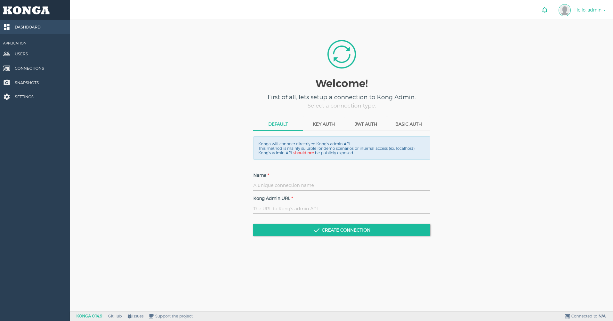

- Use o seguinte comando para pegar o nome dos serviços do kong:
``` bash
kubectl get svc -n kong
```

- Monte a URL como o exemplo abaixo, deve ser utilizado o serviço admin. Adicione o nome e a URL do kong admin no painel do konga e clique em `CREATE CONNECTION`:
```
http://kong-kong-admin.kong.svc.cluster.local:8001
```

- Após configurar a conexão com o kong admin a pagina ira atualizar e no painel esquerdo aparecerá as opções para configurarmos os services e routes:
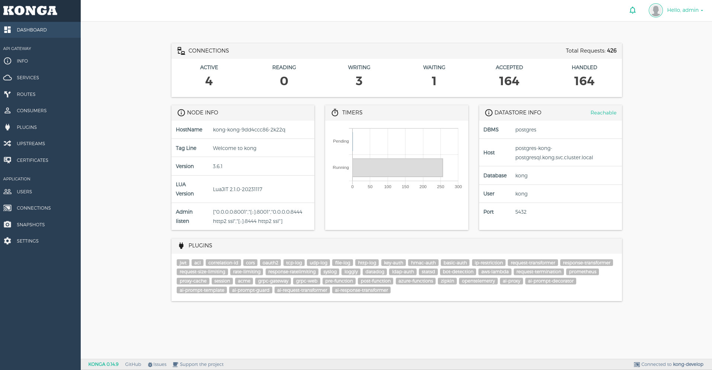

## Configure kong proxy

> [!NOTE]
> Caso você tenha configurado um ingress para o kong proxy pule para [Configure new service](#configure-new-service).

- Os seguintes passos iremos configurar um service, route e plugin para o kong proxy para podermos testa-lo sem um ingress.

- No painel esquerdo acesse `services` e em seguida clique em `ADD NEW SERVICE`:
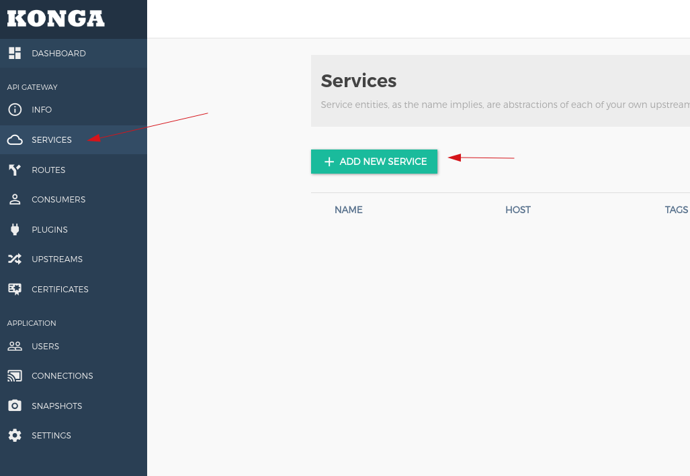

- Configure os campos necessários igual a imagem abaixo e ao final clique em `SUBMIT SERVICE`:
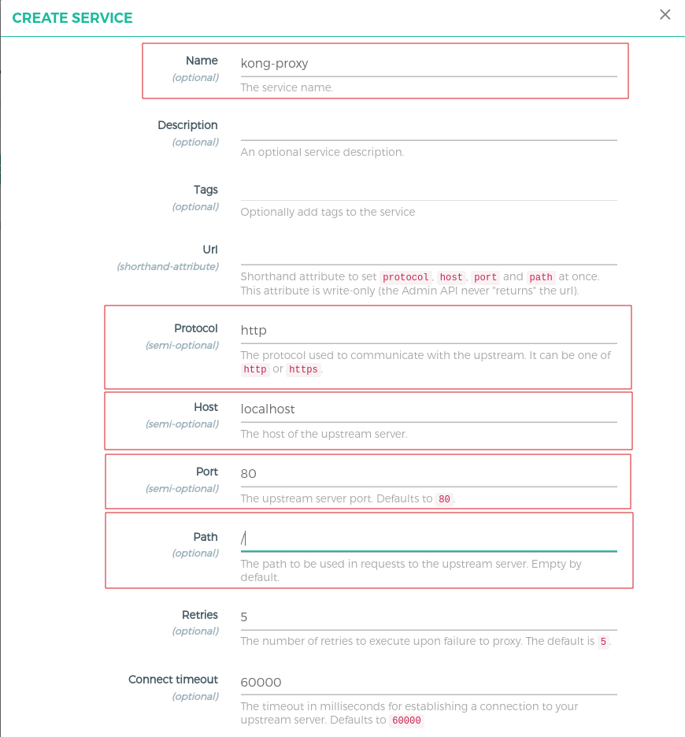

- Após o service ser criado clique no nome do service:
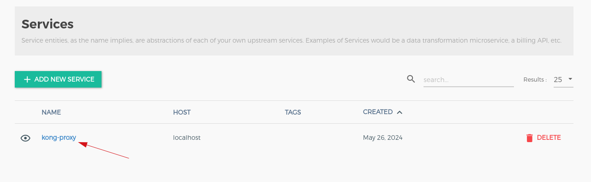

- Depois clique em `Routes` e em seguida `ADD ROUTE`:
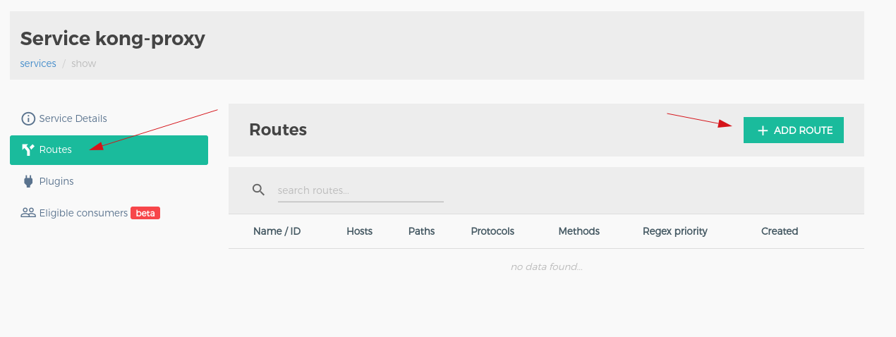

- Configure os campos necessários como na imagem abaixo, no final clique em `SUBMIT ROUTE`:
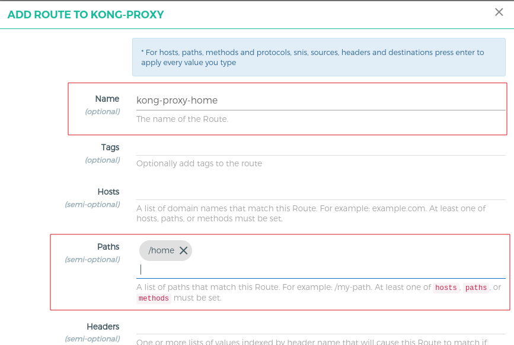

- Agora clique em `Plugins` e em seguida `ADD PLUGIN`:
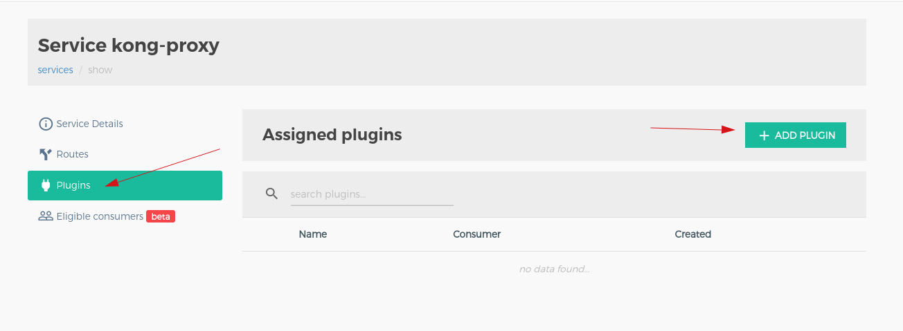

- Escolha no lado esquerdo `Traffic Control` em seguida `ADD PLUGIN` do `request termination`:
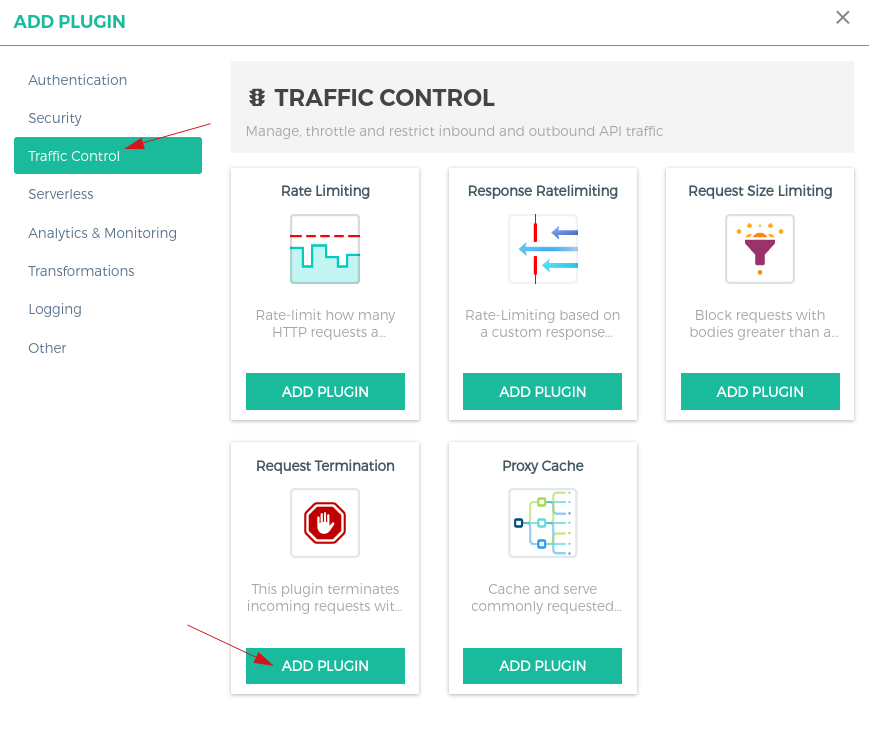

- Configure os campos necessários como a imagem abaixo e em seguida clique em `ADD PLUGIN`:
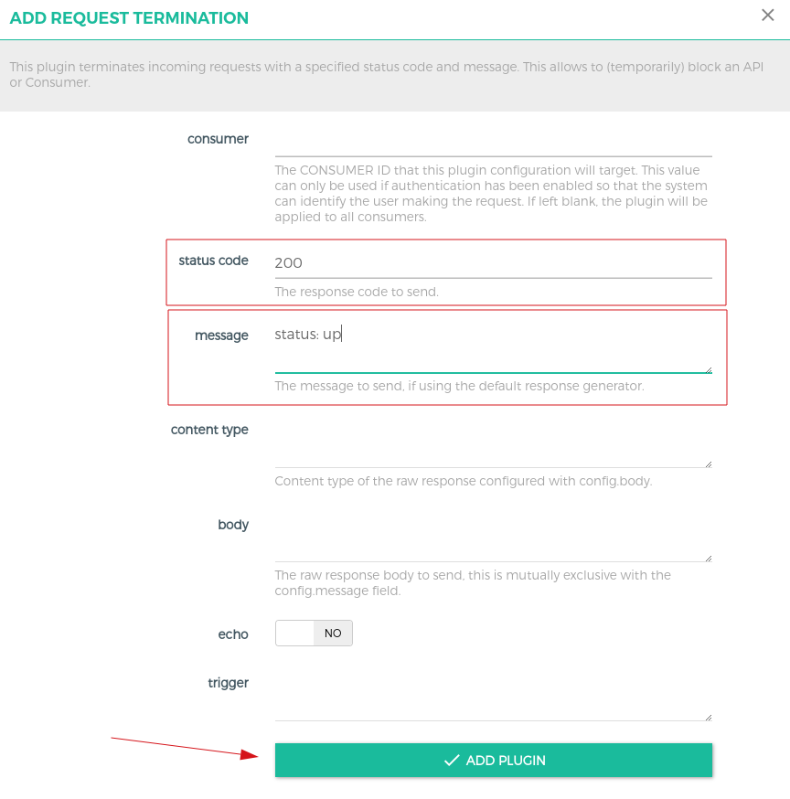

- Abra um novo terminal e execute o seguinte comando:
``` bash
kubectl port-forward service/kong-kong-proxy 8081:80 -n kong
```

- Em um terminal ou navegador use a seguinte URL do kong proxy `http://localhost:8081/home`, ele deve retornar a mesagem adicionada no plugin `request termination`:
``` bash
curl http://localhost:8081/home

# Output
{"message":"status: up"}
```

## Configure new service

- Execute o seguinte comando para criar um deployment e service para o nginx:
``` bash
kubectl apply -f deployment.yaml
```

- Crie o service para o nginx:
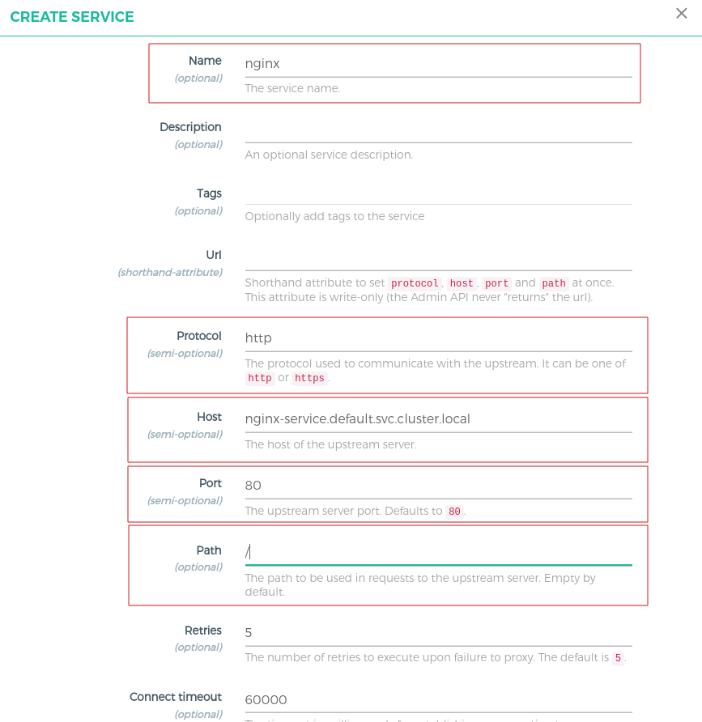

- Crie a rota para a home do nginx:
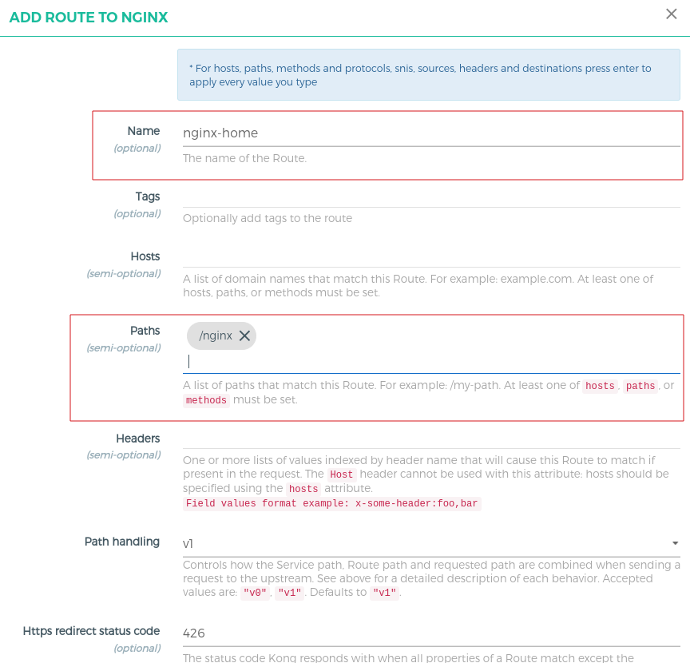

- Em um terminal ou navegador use a seguinte URL para acessar a página principal do nginx `http://localhost:8081/nginx`:
``` bash
curl http://localhost:8081/nginx

# Output
<!DOCTYPE html>
<html>
<head>
<title>Welcome to nginx!</title>
<style>
html { color-scheme: light dark; }
body { width: 35em; margin: 0 auto;
font-family: Tahoma, Verdana, Arial, sans-serif; }
</style>
</head>
<body>
<h1>Welcome to nginx!</h1>
<p>If you see this page, the nginx web server is successfully installed and
working. Further configuration is required.</p>

<p>For online documentation and support please refer to
<a href="http://nginx.org/">nginx.org</a>.<br/>
Commercial support is available at
<a href="http://nginx.com/">nginx.com</a>.</p>

<p><em>Thank you for using nginx.</em></p>
</body>
</html>
```

- Acesse a rota do nginx criada anteriormente e acesse a area de plugin da rota. Adicione o plugin `Rate Limiting`: 
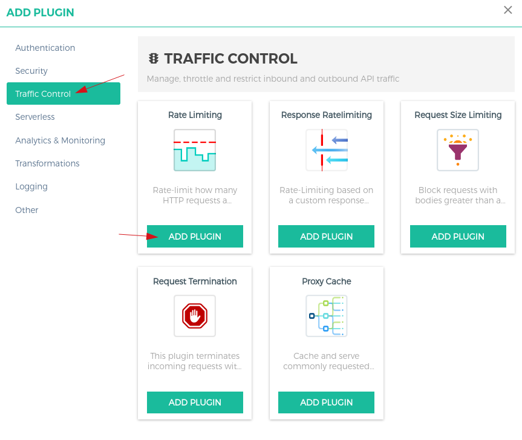

- Configure o plugin, no exemplo abaixo esta limitando a rota do nginx para que cada IP possa acessar apenas 3 vezes dentro de um intervalo de 1 minuto, ao final clique em `ADD PLUGIN`:
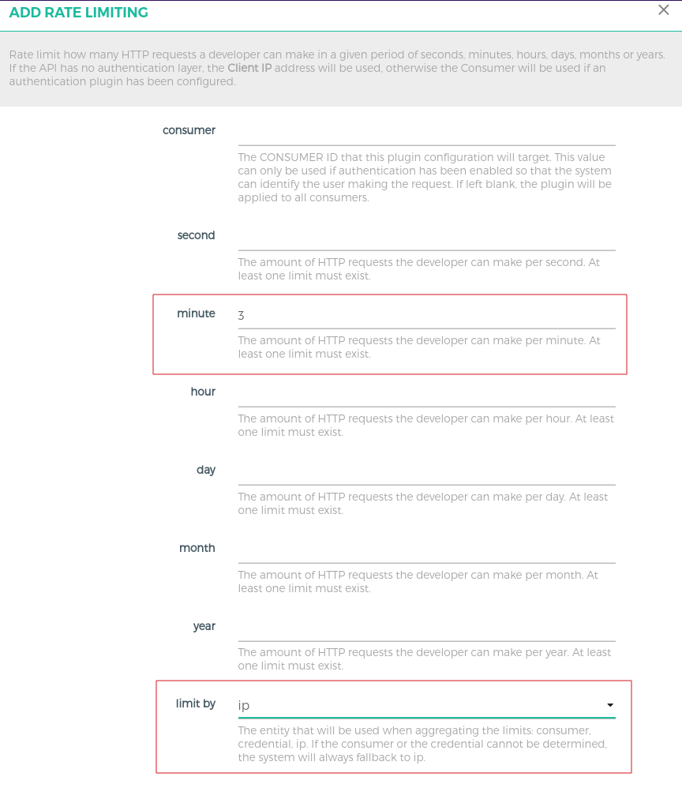

- Em um terminal ou navegador access a url `http://localhost:8081/nginx` e atualize a paginá até aparecer uma mensagem como o exemplo abaixo. No caso deste exemplo ao tentar acessar a pagina pela 4 vez o kong irá bloquear meu acesso devido ao limitador que configuramos:
``` bash
{
  "message":"API rate limit exceeded",
  "request_id":"b72af6589abac01a75754b0d01943428"
}
```